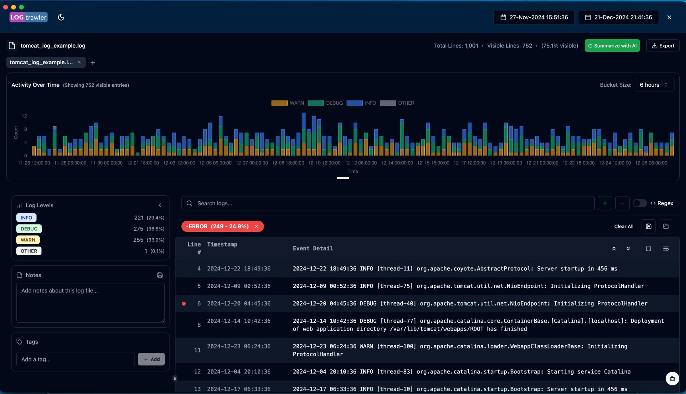

# Log Trawler

Client-side tool for analyzing log files.

## Main features

1. 100% local processing in your browser, no data uploaded to the internet.
2. Automatically supports logs of many types (Apache, Nginx, PostgreSQL, Oracle, MySQL etc).
3. Auto detects the Timestamp in many formats.
4. Auto detects the Log level if there is one (E.g. WARNING, CRITICAL, ERROR).
5. Visualizes the log message over time on a chart by Log level.
6. Lets you drill down by time range.
7. Lets you drill down by Log level.
8. Apply you own Include/Exclude filters including RegEx expressions.
9. Save Filters for reuse.
10. Add Notes to log files.
11. Add Tags to your log files.
12. Mark lines within your log files.
13. Export cut down logs after filtering.
14. Right-click send to Search engine.
15. Right-click Ask ChatGPT.

## Initial screen

On this screen you can load log files either by drag and drop or file open or clicking a previously opened file from the Recent files list.

## Log file view

In the Log view you can filter by time, by log level or on any text in the file using include/exclude filters. Filter also support RegEx matching and can be saved for reuse. Once you have a short list of lines of interest you can bookmark them, add notes and tags to add more context to the log. Right clicking on selected text within the log allows quick search on popular search engines or getting an AI response from ChatGPT (requires an OpenAI API key).

## License

DBmarlin/log-trawler is licensed under the [Apache License 2.0](https://github.com/DBmarlin/log-trawler/blob/main/LICENSE)